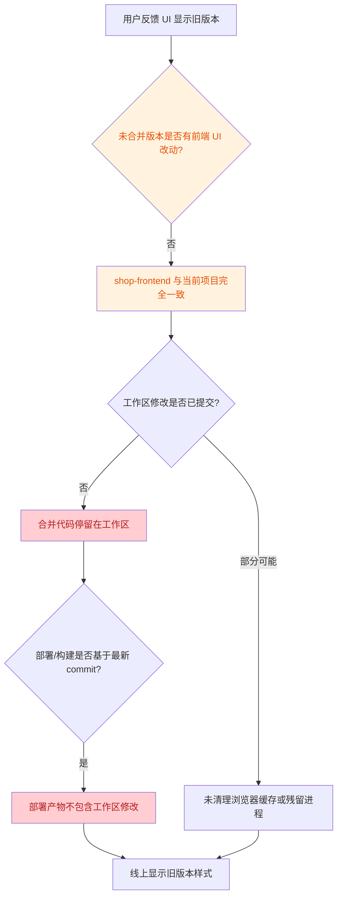

# UI 合并问题定位报告

## 1. 问题现象

在代码合并操作完成后，用户界面（UI）仍然显示旧版本样式，新开发的 UI 更改疑似未成功合并到目标分支中。

## 2. 排查过程

### 2.1 合并操作完整性检查

- **已执行的合并操作**：将未合并版本中与购物车 UI 展示相关的后端改进合并到当前项目。
- **已修改文件**：
  - `shop-backend/src/main/java/com/shop/entity/Cart.java`
  - `shop-backend/src/main/java/com/shop/repository/CartRepository.java`
  - `shop-backend/src/main/java/com/shop/service/impl/CartServiceImpl.java`

### 2.2 目标分支提交历史检查

```text
$ git log --oneline -5
43877e0 v6.0: merge T2/T8 features and tests - 234 backend + 62 frontend cases pass
56cc419 v5.0: merge T1 unit tests - 115 cases pass (100% pass)
54ece1d v4.1: split docs - T3 report + full project unit test report
634d76c v4.0: 完整单元测试套件（103 用例，100% 通过率）
db84fc5 v3.0
```

**问题发现**：合并修改目前仍停留在工作区，尚未创建 git commit。若后续部署流程基于某个 commit 或分支进行构建，则工作区中的修改不会被包含，导致线上/预览环境仍显示旧版本。

```text
$ git status --short
 M shop-backend/src/main/java/com/shop/entity/Cart.java
 M shop-backend/src/main/java/com/shop/repository/CartRepository.java
 M shop-backend/src/main/java/com/shop/service/impl/CartServiceImpl.java
 M shop-backend/src/main/resources/application-dev.yml
 M shop-backend/src/main/resources/application.yml
?? docs/合并报告.md
?? docs/项目进展记录.md
?? shop-backend/backend.err
?? shop-frontend/e2e-report/
?? shop-frontend/test-results/
?? 未合并版本/
```

### 2.3 代码冲突检查

- 已检查合并后的源代码，未发现 `<<<<<<<`、`=======`、`>>>>>>>` 等未解决冲突标记。
- 合并过程中出现的差异已通过人工决策解决（如 `AdminController` 权限校验、`application.yml` profile 结构等）。

### 2.4 前端代码对比检查

对关键 UI 文件进行 SHA256 哈希对比：

| 文件 | 当前项目 | 未合并版本 | 是否一致 |
|------|---------|-----------|---------|
| `src/views/user/Cart.vue` | `202AD31B...` | `202AD31B...` | 一致 |
| `src/views/user/Home.vue` | `B4B60E63...` | `B4B60E63...` | 一致 |
| `src/App.vue` | `F1C2EE6C...` | `F1C2EE6C...` | 一致 |

**关键发现**：`shop-frontend` 目录下的所有文件与未合并版本完全一致，不存在新的前端 UI 代码需要合并。换言之，所谓"UI 优化"并非通过修改 Vue/CSS 实现，而是通过后端返回更丰富的数据字段（`productName`、`productPrice`），使已有的前端展示逻辑生效。

### 2.5 构建产物检查

- 前端生产构建（`npm run build`）已成功生成 `dist/` 目录。
- 在 `dist/assets/Cart-*.js` 中已确认包含 `productName` 与 `productPrice` 处理逻辑，证明构建产物是最新的。

### 2.6 运行时服务检查

- 当前存在多个 `java` 与 `node` 进程，部分可能是历史遗留进程。
- 端口 `8080` 被 PID `27284` 占用，为当前项目启动的后端服务。
- 后端日志中出现 `No static resource .` 与 `No static resource @vite/client` 错误，说明有请求直接访问了 `http://localhost:8080/` 而非前端 dev server `http://localhost:3000/`。
- 直接调用 `/api/user/login` 验证：JwtInterceptor 排除路径生效，后端服务运行的是当前项目代码。

## 3. 问题根因分析



综合以上排查，UI 显示旧版本样式的主要原因如下：

1. **未创建提交（核心原因）**：合并后的代码修改仍停留在工作区，未生成 git commit。若部署流程基于分支/commit 触发，则最新修改不会被纳入构建。
2. **无前端代码变更**：未合并版本的 `shop-frontend` 与当前项目完全一致，不存在新的 Vue/CSS 样式代码。所谓 UI 优化完全依赖后端新增数据字段。
3. **浏览器/进程缓存**：即使代码已提交，若浏览器缓存未清除或旧服务进程仍在运行，用户仍可能看到旧样式。
4. **直接访问后端端口**：日志显示有请求直接命中 `localhost:8080`，而静态资源应由前端 dev server 或 CDN 提供，直接访问后端会导致 404 与样式缺失。

## 4. 解决方案

### 4.1 立即处理（必须）

1. **提交合并代码**

   ```bash
   git add shop-backend/src/main/java/com/shop/entity/Cart.java
   git add shop-backend/src/main/java/com/shop/repository/CartRepository.java
   git add shop-backend/src/main/java/com/shop/service/impl/CartServiceImpl.java
   git commit -m "merge: 购物车 UI 数据支撑优化（productName/productPrice）"
   ```

2. **清理残留进程并重启服务**

   ```powershell
   # 停止所有 java / node 进程
   Get-Process java, node | Stop-Process -Force
   # 重新启动后端
   cd shop-backend
   mvn spring-boot:run
   # 重新启动前端
   cd shop-frontend
   npm run dev
   ```

3. **清除浏览器缓存**
   - 打开 `http://localhost:3000` 后，按 `Ctrl + Shift + R` 强制刷新；
   - 或在 DevTools → Network 中勾选 "Disable cache" 后刷新。

### 4.2 部署流程建议

1. **确保 CI/CD 触发条件包含工作区提交**：合并后务必提交并推送，避免部署流程基于旧 commit 构建。
2. **构建产物版本化**：每次部署前重新执行 `npm run build`，并确认 `dist/assets/Cart-*.js` 包含 `productName`/`productPrice`。
3. **统一访问入口**：生产环境应通过前端服务器/Nginx/CDN 访问静态资源，避免直接请求后端 `8080` 端口获取 HTML/CSS/JS。

### 4.3 后续优化（可选）

- 若需要更明显的 UI 样式变化（如布局、颜色、组件调整），需在 `未合并版本` 中确认是否存在遗漏的 Vue/CSS 文件，或单独进行前端 UI 迭代。
- 建议扩展 Playwright E2E 配置，覆盖 Firefox/WebKit 及移动设备视口，提升跨浏览器兼容性验证。

## 5. 结论

- **合并操作本身已完整执行**，不存在未解决的代码冲突。
- **关键缺失**：合并代码未提交到 git 历史，导致基于 commit 的部署/构建流程无法获取最新修改。
- **无前端代码变更**：未合并版本的 `shop-frontend` 与当前项目完全一致，UI 变化由后端数据字段驱动。
- 按第 4 节方案执行提交、清理进程、重启服务并清除缓存后，购物车页面应能正确显示商品名称与价格。
